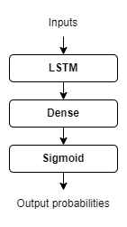

# Philosophy 2 - Introduction to AI
Supplementary materials for Assignment 2 of Philosophy 2 - Introduction to AI course of Innopolis University.
The repository containes the code for training and the pretrained network in the `.h5` format with the following topology:

## Technologies:
- [Python 3.9](https://www.python.org/)
- [Tensorflow 2](https://www.tensorflow.org/)
- [Maestro Dataset v2](https://magenta.tensorflow.org/datasets/maestro)
## How to train
1. Install the requirements: ```pip3 install -r requirements.txt```
2. Run the `train.ipynb` notebook: ```python3 -m notebook train.ipynb``` and run the notebook
3. The trained network is saved into `net.h5`
